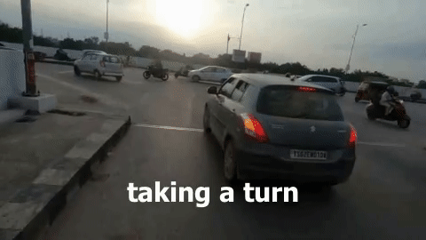

# CS-MRBD: A Motorcycle Rider Behavior Dataset for Chaotic Streets

## Inference in Colab

https://colab.research.google.com/drive/1rCiXE7E20NK3UnniUyt6oEe-w1wNvYK0?usp=sharing

## Demo of CS-MRBD Dataset

