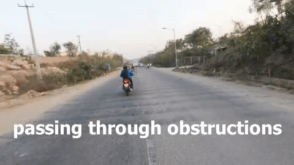

# CS-MRBD: A Motorcycle Rider Behavior Dataset for Chaotic Streets

##Inference
https://colab.research.google.com/drive/1rCiXE7E20NK3UnniUyt6oEe-w1wNvYK0#scrollTo=TYH-ANh5_SIF

## Demo of CS-MRBD Dataset

